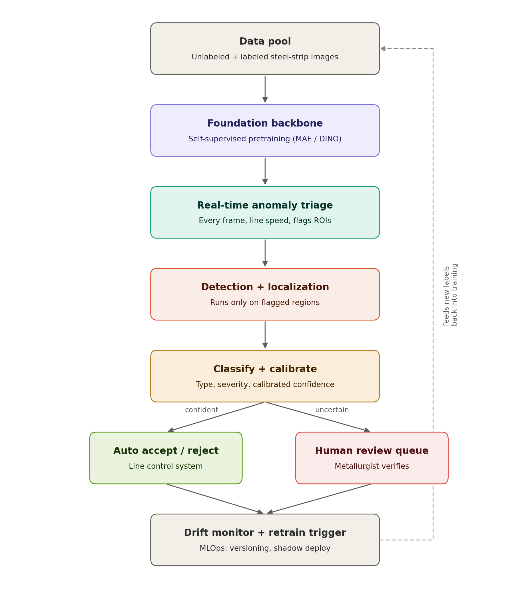

# Steel Surface Defect Detector

A complete, production-shaped deep-learning pipeline for classifying steel
surface defects from the **NEU-CLS** dataset — six defect types photographed
under a line-scan camera on a real hot-rolled steel strip:

| Class | Description |
|---|---|
| Crazing | Fine network of interconnected surface cracks (thermal/rolling stress) |
| Inclusion | Foreign, non-metallic material trapped in the steel during casting |
| Patches | Irregular, discoloured surface regions from uneven scale removal |
| Pitted | Small localised pits/cavities, often corrosion-related |
| Rolled-in Scale | Oxide scale pressed into the surface during hot rolling |
| Scratches | Linear surface marks from mechanical handling contact |

This repo takes the problem from raw images to a deployable artifact:
**transfer-learning classifier → stratified cross-validation → Grad-CAM
explainability → ONNX export → interactive demo**, with every design
decision explained below rather than left implicit in code.

---

## Why this architecture (the ML reasoning)

**Transfer learning, not training from scratch.**
NEU-CLS has ~1,800 images total — 300 per class. That's nowhere near enough
to learn good low-level filters (edges, textures, gradients) from random
initialization. Instead, `src/model.py` starts from an ImageNet-pretrained
backbone (`efficientnet_b4` by default, configurable) and fine-tunes it. The
backbone already knows how to detect edges and textures; we only need to
teach it what *these particular* textures mean.

**Discriminative learning rates.**
The backbone is fine-tuned at `lr * 0.1`; the newly-initialized classifier
head trains at the full `lr`. The head starts from nothing and needs to move
a lot; the backbone already encodes something useful and should be nudged,
not overwritten. See `SteelDefectNet.param_groups()`.

**Domain-specific augmentation, not generic ImageNet augmentation.**
`src/dataset.py`'s `SteelSurfaceAugment` was deliberately built around what's
physically valid for a steel surface photographed by a fixed line-scan
camera, documented directly in its docstring:

| Augmentation | Used? | Why |
|---|---|---|
| Horizontal / vertical flip | yes | surface has no inherent orientation |
| 90/180/270 degree rotation | yes | rotationally symmetric under a top-down scan |
| Arbitrary rotation (0-360 degrees) | no | introduces black-border artefacts the model could exploit as a shortcut |
| Mild brightness/contrast | yes | simulates line-lighting variation across the strip |
| CutOut (random erase) | yes | forces the model to use non-local evidence, not one salient patch |
| Strong blur | no | destroys the fine texture that *is* the class signal (e.g. crazing) |
| Strong colour jitter | no | unphysical — these are effectively grayscale surfaces |

Getting this table wrong is a common failure mode in industrial vision: naive
`torchvision.transforms.RandAugment`-style pipelines borrowed from ImageNet
recipes will happily rotate/blur/recolor away the exact texture cues that
distinguish "crazing" from "scratches."

**Stratified 5-fold cross-validation, not a single train/val split.**
With only 1,800 images, a single 80/20 split leaves ~360 validation images —
enough for the reported accuracy to swing meaningfully based on which images
happened to land in validation. `train.py` runs `StratifiedKFold` so every
class is represented proportionally in every fold, trains the model 5 times,
and reports **mean +/- std** of accuracy and macro-F1. This is a materially
more trustworthy estimate of real-world performance than a single number,
and it produces 5 independent checkpoints that could be ensembled.

**Macro-F1 as the headline metric, not accuracy.**
NEU-CLS itself is class-balanced, but real production lines are not — some
defects are much rarer than others. Macro-F1 punishes a model that quietly
ignores a rare class even while overall accuracy looks fine, so it's used
for early stopping and "best epoch" selection (`src/utils.py:compute_metrics`,
`EarlyStopping`).

**Grad-CAM explainability, because "right for the wrong reason" is a real
risk here.**
NEU-CLS images have subtle scanning artefacts and lighting gradients near
their borders. A classifier can learn to shortcut on those instead of the
actual defect texture — and would still score well on this dataset while
being useless (or dangerous) on a new camera setup. `src/gradcam.py` wraps
`pytorch-grad-cam` around the model's last convolutional feature map so a
QA engineer can visually confirm the model is attending to the defect
itself before it's trusted in production. This runs automatically after
every fold (`outputs/fold*/gradcam_samples.png`) and is exposed live in the
Gradio demo.

**ONNX export with a numerical parity check.**
A plant's edge inference box rarely runs a full Python/PyTorch stack.
`src/export_onnx.py` exports the trained model to ONNX and then *verifies*
it by running the same input through both PyTorch and ONNXRuntime and
comparing outputs — silently-broken exports (a real, common failure mode
with custom heads/dropout) are caught immediately instead of at deployment.

---

## System architecture



A single closed-set classifier on a pre-cropped image — the kind of model
trained by `train.py` in this repo — is one stage of a larger system, not
the whole solution to the manufacturing problem. It assumes the defect has
already been found, is already centered in frame, is already one of a fixed
set of known types, and that a raw softmax probability is trustworthy
enough to act on. None of those assumptions survive contact with a real
production line, where defects appear at arbitrary locations on a moving
strip, multiple defects can co-occur in one frame, genuinely new defect
types show up that no one has labeled yet, and a false negative can mean a
defective coil shipping to a customer. The diagram above shows the full
pipeline this project is designed to fit into, end to end.

**Data pool.** Every frame the plant's line-scan cameras capture is
retained, labeled or not. Unlabeled images are nearly free to collect since
the cameras are already running; labeled images require a metallurgist's
time and are the scarce resource the rest of the architecture is designed
to conserve.

**Foundation backbone.** Rather than starting from ImageNet weights, the
backbone is pretrained with a self-supervised objective — masked-image
modeling (MAE) or self-distillation (DINO-style) — directly on the plant's
own unlabeled footage. ImageNet weights encode what natural photographs of
everyday objects look like; a backbone pretrained this way encodes what
*this plant's steel texture statistics* look like, using the abundant
unlabeled pool instead of expensive labels. Every stage downstream —
anomaly detection, defect classification, novel-defect clustering — reuses
this same embedding space.

**Real-time anomaly triage.** A lightweight one-class model (a memory-bank
approach like PatchCore, or a small autoencoder/normalizing-flow density
head) trained almost entirely on normal surface — cheap to collect, since
it needs no defect labels at all — runs on every single frame at full line
speed, quantized to INT8 and compiled for millisecond-level latency. This
is the stage that keeps the system honest about defects it has never seen:
an anomaly detector doesn't need a label for a failure mode to flag it as
"not normal," so a new steel grade, a new failure mode, or a degrading
roller gets caught here even when nothing downstream has a class for it.
It also solves the compute-budget problem — only the regions this stage
flags get passed to the expensive stages that follow.

**Detection and localization.** A detector fine-tuned from the same
foundation backbone runs only on flagged regions and outputs bounding boxes
with a multi-task head: defect type and a size/depth estimate together,
because real accept/reject decisions under steel grading standards (ASTM,
EN) depend on how large and how deep a defect is, not merely that one is
present.

**Classify + calibrate.** This is the stage the classifier in this
repository (`train.py`, `src/model.py`) is built for — but production use
requires two things a benchmark classifier skips. First, calibration
(temperature scaling on a held-out set), because raw softmax confidence is
routinely overconfident and an automated decision built on an uncalibrated
number is built on sand. Second, uncertainty quantification: a small deep
ensemble — the five checkpoints already produced by this repo's 5-fold
cross-validation are, for free, five independently seeded models suitable
for exactly this — or MC-Dropout, measuring how much the model's
predictions disagree with themselves. Predictions where the ensemble
disagrees are treated as uncertain regardless of how confident any single
model is.

**Confidence-gated decision.** Confident predictions go straight to the
line control system for automated accept/reject. Uncertain ones — low
confidence, high ensemble disagreement, or anomaly-flagged but
unclassifiable — are routed to a human review queue instead of forcing the
model to guess. This is the single design choice that makes the system
trustworthy enough to deploy: it does not need to be right every time, it
only needs to know when it doesn't know.

**Drift monitor and retrain trigger.** Both paths feed an MLOps layer that
tracks embedding-distribution shift against the training distribution
(population stability index or MMD), versions every dataset and model
(e.g. DVC plus a model registry), and promotes retrained models through
shadow deployment and canary rollout rather than swapping models in blind.
Human-reviewed cases — especially ones that came from an anomaly flag with
no good classifier match — feed back into the data pool as new labeled
examples, closing the loop and giving the taxonomy itself a way to grow as
new defect types are discovered, rather than staying fixed at whatever six
classes NEU-CLS happened to define.

---

## Project structure

```
steel-defect-detector/
├── docs/
│   ├── architecture.png              # system architecture diagram (embedded above)
│   └── generate_architecture_diagram.py
├── configs/default.yaml     # every hyperparameter in one place
├── scripts/
│   └── prepare_data.py      # turn a raw NEU-CLS/NEU-DET download into the expected layout
├── src/
│   ├── dataset.py           # NEUCLSDataset + SteelSurfaceAugment (provided, documented above)
│   ├── model.py             # SteelDefectNet: timm backbone + head, discriminative LR groups
│   ├── engine.py            # train_one_epoch / evaluate, AMP, warmup+cosine schedule
│   ├── utils.py             # seeding, checkpoints, metrics, plots
│   ├── gradcam.py           # Grad-CAM explainability
│   ├── export_onnx.py       # ONNX export + PyTorch/ONNXRuntime parity check
│   └── infer.py             # CLI single-image inference
├── train.py                 # stratified k-fold CV training driver
├── app.py                   # Gradio demo (upload → prediction + Grad-CAM)
└── requirements.txt
```

---

## Setup

```bash
git clone https://github.com/SankaVaas/steel-defect-detector.git
cd steel-defect-detector
pip install -r requirements.txt
```

## Data

The pipeline expects the Kaggle NEU-DET layout:

```
NEU-CLS/
├── train/images/{crazing,inclusion,patches,pitted_surface,rolled-in_scale,scratches}/*.jpg
└── validation/images/{...same six folders...}/*.jpg
```

Get the raw data and reshape it into that layout with `scripts/prepare_data.py`,
which auto-detects several common source layouts (flat `IMAGES/` dumps,
per-class folders, or an already-correct Kaggle layout):

```bash
# Option A: Kaggle CLI (requires a free Kaggle account + API token)
pip install kaggle
kaggle datasets download -d kaustubhdikshit/neu-surface-defect-database
unzip -q neu-surface-defect-database.zip -d raw_neu
python scripts/prepare_data.py --input raw_neu --output ./NEU-CLS

# Option B: any other NEU-CLS/NEU-DET mirror you've already downloaded
python scripts/prepare_data.py --input /path/to/raw/download --output ./NEU-CLS
```

`prepare_data.py` walks the entire input tree recursively (any nesting
depth), matches images to classes by filename/folder with spelling
normalization (`rolled-in-scale`, `rolled_in_scale`, `Rolled In Scale` all
match `rolled-in_scale`), and ignores non-image sibling folders like
`annotations/` that ship alongside the Kaggle NEU-DET object-detection
variant. If it can't find any class-labelled images it prints the actual
files it found under `--input` so you can see what went wrong, instead of
failing silently.

## Train

```bash
# Full run as specified in configs/default.yaml (EfficientNet-B4, 30 epochs, 5-fold CV)
python train.py --config configs/default.yaml

# Quick smoke test on modest hardware
python train.py --config configs/default.yaml \
  --backbone resnet18 --epochs 5 --folds 2 --batch-size 16

# No internet access to download pretrained ImageNet weights? Train from scratch:
python train.py --config configs/default.yaml --no-pretrained
```

Outputs per fold, under `outputs/fold{N}/`:
- `best_model.pt` — checkpoint with the highest validation macro-F1
- `metrics.json` — accuracy, macro-F1, per-class precision/recall/F1, confusion matrix
- `confusion_matrix.png`, `training_curves.png`, `gradcam_samples.png`

Plus `outputs/cv_summary.json` — mean +/- std accuracy/macro-F1 across folds.

## Evaluate a single image

```bash
python -m src.infer --checkpoint outputs/fold0/best_model.pt \
  --image path/to/steel.jpg --gradcam-out cam.png
```

## Export to ONNX (for deployment off the Python/PyTorch stack)

```bash
python -m src.export_onnx --checkpoint outputs/fold0/best_model.pt --out steel_defect.onnx
```

## Interactive demo

```bash
python app.py --checkpoint outputs/fold0/best_model.pt
```

Upload an image and get back the predicted class, full probability
distribution, and a Grad-CAM overlay explaining the prediction.

---

## Results

See `outputs/cv_summary.json` and `outputs/fold*/metrics.json` for the
numbers from the most recent training run in this repo (backbone, epoch
count, and hardware used are recorded in each fold's `metrics.json` via the
saved config). Cross-validated macro-F1 is the headline number to compare
across model/hyperparameter changes, not any single fold's accuracy.

## License

MIT — see `LICENSE`.
